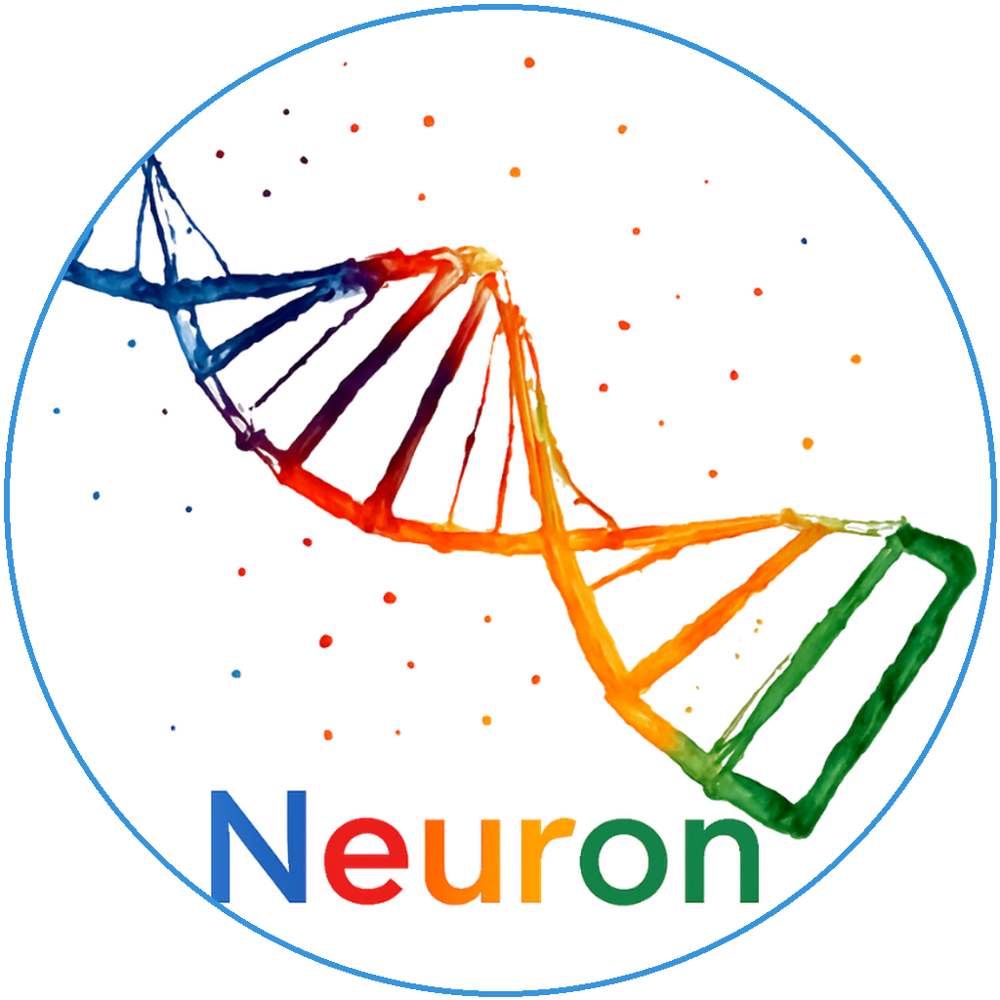

# Neuron

<p align="center">
  
</p>

<h3 align="center">Local file intelligence for the edge.</h3>

<p align="center">
  <a href="https://zero-x.live"></a>
  
  
  
</p>

<p align="center">
  
  &nbsp;&nbsp;
  
  &nbsp;&nbsp;
  
  &nbsp;&nbsp;
  
  &nbsp;&nbsp;
  
</p>

Neuron is a Windows desktop application for private, local file intelligence. It indexes your files, performs offline semantic search, summarizes documents, and answers questions with a local Qwen GGUF model. Internet mode is optional and off by default.

The brand direction is intentionally stark: near-black canvas, white product voice, sharp orange for action, cyan for live/edge signals, and muted grey for secondary text.

## Positioning

Data centers are power hungry. Neuron shifts useful AI work to the local machine when privacy, latency, and cost matter more than cloud scale.

Use it when you want:

- Fast local search across documents, code, notes, PDFs, spreadsheets, and presentations.
- Offline semantic search using bundled BGE Small ONNX embeddings and a FAISS/HNSW index.
- Local Qwen output generation after the installer performs the one-time model download.
- A headless command surface through `neufs.py` / `neufs.cmd`.
- Optional internet-assisted answers through an explicit toggle, routed as Internet -> Model -> User.

## Core Capabilities

| Icon | Capability | What it means |
|---:|---|---|
|  | Semantic search | Find files by meaning, not only by exact names. |
|  | Local Qwen output | Generate answers with the installer-provisioned GGUF model. |
|  | Private by default | Local index, local model, optional internet mode off by default. |
|  | Headless mode | Run `neufs` commands without opening the desktop UI. |
|  | Hotkey launcher | Global shortcuts show or focus the panel without hold-to-hide flicker. |
|  | Bundled app | PyInstaller one-dir package includes runtime assets and local models. |

## Current Product Surface

| Surface | Status | Notes |
|---|---:|---|
|  Desktop UI | Active | PyQt6 Spotlight-style panel with tray activation |
|  MemoryOS chat | Active | Auto/query/action modes with local model responses |
|  Offline semantic search | Active | Bundled BGE ONNX embeddings plus vector index |
|  Qwen GGUF generation | Active | Installer downloads Qwen 2.5 Coder 3B into `%LOCALAPPDATA%\Neuron\models` |
|  Internet mode | Optional | Off by default, explicit user-controlled toggle |
|  Headless CLI | Active | `neufs status`, `search`, `chat`, `action`, `index`, `summarize` |
|  Rust/Tauri port | Drafted | See `docs/rust_react_desktop_port_draft.md` |

## Brand Palette

| Token | Hex | Use |
|---|---|---|
| `carbon` | `#050509` | Background, app frame, README badges |
| `white` | `#FFFFFF` | Primary typography and product mark |
| `muted` | `#9B9BA8` | Supporting copy and secondary labels |
| `action` | `#FF4D00` | Action mode, warnings, decisive CTAs |
| `edge` | `#00D4FF` | Internet/live state and edge-compute signal |
| `violet` | `#7C3AED` | MemoryOS/AI accent when needed |

## Quick Start From Source

```powershell
git clone https://github.com/RAHUL-DevelopeRR/deepseekfs.git
cd deepseekfs
python -m venv venv
.\venv\Scripts\Activate.ps1
pip install -r requirements.txt
python run_desktop.py
```

The desktop app preloads an existing local Qwen GGUF model before PyQt starts. It does not download the model during desktop launch.

## Headless Commands

```powershell
python neufs.py status
python neufs.py search "quarterly revenue report"
python neufs.py chat "Summarize this project"
python neufs.py chat --internet "Who is the current chief minister of Tamil Nadu?"
python neufs.py summarize "C:\path\to\file.pdf"
python neufs.py index
```

On Windows, `neufs.cmd` is provided as a convenience wrapper.

## Hotkeys

| Shortcut | Behavior |
|---|---|
| `Shift + Space` | Show or focus Neuron |
| `Ctrl + Space` | Fallback show/focus shortcut |
| `Ctrl + Alt + Space` | Safer fallback show/focus shortcut |
| `Ctrl + Alt + N` | OS-safe fallback show/focus shortcut |
| `Esc` | Hide the panel |
| `Ctrl + Shift + R` | Research overlay |

The global hotkey intentionally shows/focuses instead of toggling closed. This avoids the Windows repeat behavior where a held key opens and immediately hides the panel.

## Local Model And Cache Strategy

Model lookup order:

1. Bundled app model under `storage/models`.
2. `%LOCALAPPDATA%\Neuron\models`.
3. Paths listed in `NEURON_MODEL_DIRS`.
4. Existing Hugging Face cache entries.

Downloads use partial files and verified final files. Desktop preload uses `allow_download=False`, so a missing model is reported instead of triggering a surprise launch-time download.

Recommended runtime defaults:

```powershell
$env:NEURON_LLM_MMAP = "1"
$env:NEURON_LLM_BATCH = "256"
$env:NEURON_BACKGROUND_PREWARM = "0"
```

## Build

The current deliverable is a PyInstaller one-dir bundle:

```powershell
python -m PyInstaller neuron_onedir.spec --noconfirm --clean
```

Output:

```text
dist\Neuron\Neuron.exe
```

Neuron Cockpit also has an Inno Setup installer that bundles the Tauri shell,
the packaged backend, and the BGE ONNX embedding model, then downloads Qwen
2.5 Coder during setup:

```powershell
.\scripts\build_neuron_cockpit_installer.ps1
```

To hand off a single archive:

```powershell
Compress-Archive -Path dist\Neuron -DestinationPath dist\Neuron-windows-x64.zip -Force
```

## Test Matrix

Run the complete local suite:

```powershell
python -m py_compile run_desktop.py neufs.py services\llm_engine.py services\memory_os.py services\model_manager.py services\ollama_service.py services\internet_search.py services\stability.py ui\hotkeys.py ui\memoryos_panel.py ui\spotlight_panel.py
python -m pytest -q
python neufs.py status
python neufs.py search "readme" --limit 3
python neufs.py chat --offline "Say OK in one word."
```

Extra desktop verification:

- Launch `python -X faulthandler run_desktop.py`.
- Confirm Qwen is found locally and preloaded before PyQt.
- Confirm hotkey registrations are logged.
- Confirm `storage/logs/native_crash_dump.log` has no new access violation.
- Confirm `storage/logs/ui_hang_dump.log` is not generated during idle use.

## Architecture

```text
User
  |
  +-- PyQt6 Desktop UI
  |     |
  |     +-- MemoryOS panel
  |     +-- Spotlight search panel
  |     +-- Global hotkey manager
  |
  +-- neufs CLI
        |
        v
Desktop services
  |
  +-- Intent routing
  +-- Search / indexing
  +-- Optional internet retrieval
  +-- Tool validation and permissions
        |
        v
Local engines
  |
  +-- BGE Small embeddings
  +-- FAISS/HNSW index
  +-- llama.cpp Qwen GGUF
```

The next architecture step is process isolation: React/Tauri UI, Rust core daemon, separate LLM worker, and separate indexer worker. That keeps the UI alive even when model inference, indexing, or parsing fails.

## Runtime Logs

Important logs live under:

```text
storage\logs\
storage\crash.log
```

The desktop enables Python faulthandler for native crashes and a UI hang watchdog for event-loop stalls.

## Repository Layout

```text
app/                  configuration and logging
core/                 embeddings, indexing, search, ingestion, watcher
services/             MemoryOS, model management, tools, validation, internet mode
ui/                   PyQt6 desktop UI
tests/                unit and regression tests
docs/                 verification notes and Rust/Tauri port draft
storage/models/       local/bundled model assets
run_desktop.py        desktop entrypoint
neufs.py              headless CLI
neuron_onedir.spec    PyInstaller bundle definition
```

## License

MIT.
