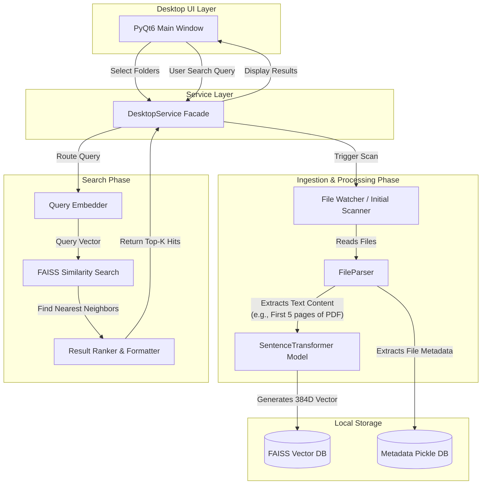

# DeepSeekFS Architecture and Flow Analysis

## Application Architecture Overview

DeepSeekFS is a local desktop application built with **PyQt6** for semantic file search. It avoids external network dependencies, running all inferences locally on the CPU. The architecture follows a monolithic design with modularized core components:

*   **UI Layer (`run_desktop.py`)**: A single PyQt6 window managing user inputs, search results presentation, and background worker threads (`IndexThread`, `SearchThread`) to keep the UI responsive.
*   **Service Layer (`services/desktop_service.py`)**: Acts as a facade between the PyQt6 UI and the core business logic. It handles the orchestration of indexing and searching operations.
*   **Indexing & Storage (`core/indexing/index_builder.py`)**: Manages a singleton **FAISS** index (`faiss.IndexFlatL2`) and a metadata store (`metadata.pkl`) to persist document embeddings and file information.
*   **Embeddings Model (`core/embeddings/embedder.py`)**: Wraps the Hugging Face `SentenceTransformer` model (`all-MiniLM-L6-v2` by default). It is configured to run entirely on the CPU.
*   **File Parser (`core/ingestion/file_parser.py`)**: Responsible for extracting raw text from various file formats (.txt, .md, .pdf, .docx, .json, .csv, and code files).
*   **Real-time Watcher (`core/watcher/file_watcher.py`)**: Monitors configured directories for new or modified files to keep the FAISS index up to date.
*   **Search Engine (`core/search/semantic_search.py`)**: Handles the retrieval logic by encoding the search query and finding the nearest neighbors in the FAISS index, potentially combining semantic scores with time decay or frequency scores.

## How the App Works with Semantic Models

The application does **not** rely on hardcoded tags for document semantics. **The model actually reads the true content of your documents** to build a rich semantic understanding.

Here is how the semantic embedding pipeline works:

1.  **Parsing Phase**: When a file is discovered, `FileParser` uses specialized libraries to read the file's raw text content.
    *   **PDFs**: Uses `PyMuPDF` (`fitz`) to extract text from the first 5 pages (up to 5000 characters).
    *   **Word Documents (.docx)**: Uses `python-docx` to extract text from paragraphs (up to 5000 characters).
    *   **Text/Code/CSV/JSON**: Directly reads the file content (up to 5000 characters).
    *   *Exception for Videos*: Video formats (.mp4, .mkv, etc.) simply extract semantics from the clean filename (e.g., `Video file: my vacation trip`).
2.  **Embedding Phase**: The extracted raw text string (up to 5000 characters) is passed to the `Embedder`.
3.  **Neural Network Inference**: The `SentenceTransformer` (`all-MiniLM-L6-v2`) converts this text chunk into a high-dimensional dense vector (a 384-dimensional array). This sequence of numbers captures the *meaning* (semantics) of the words in the file, not just the keywords.
4.  **Vector Storage**: This 384-dimensional mathematical representation is saved into the local FAISS index alongside the file's metadata.

When you type a search query, the app runs the exact same embedding model on your query text. FAISS then mathematically calculates the Euclidean distance between your query's vector and all stored document vectors. Files with the closest vector distance are returned as the most semantically relevant.

## System Flow Diagram

### Conclusion
To answer your specific question: **Yes, the model reads and processes the actual text content of your PDFs, Word documents, and text files.** The semantic understanding is authentic and driven by a state-of-the-art Natural Language Processing model (`MiniLM`), not hardcoded keyword matching. The system only falls back to filenames for binary, non-textual files like videos.
